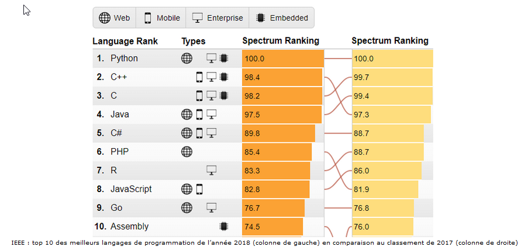
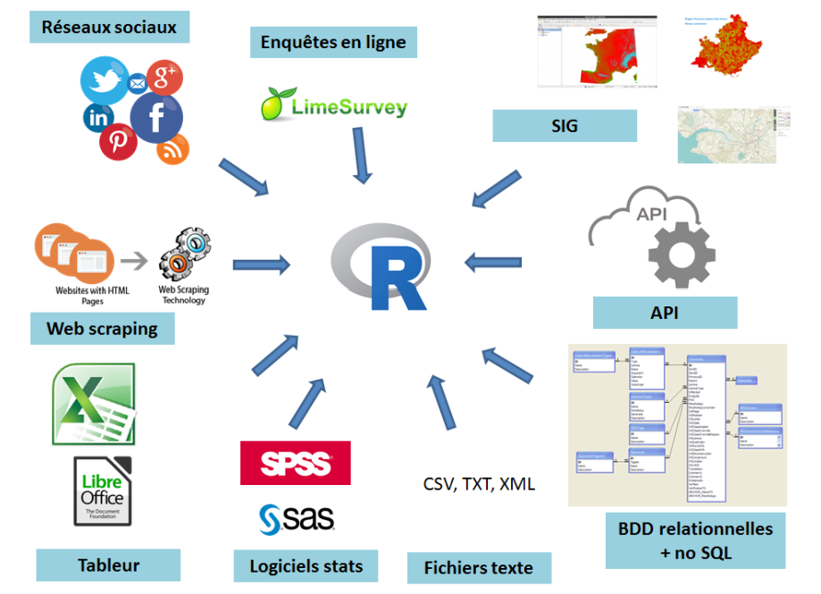
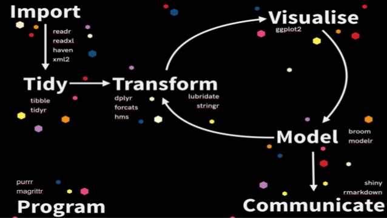
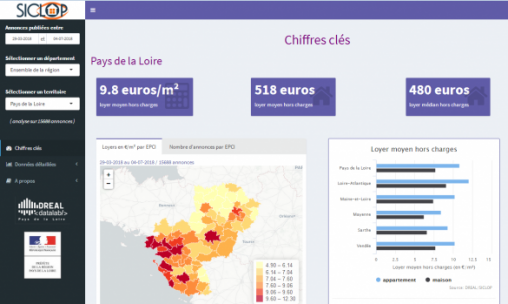
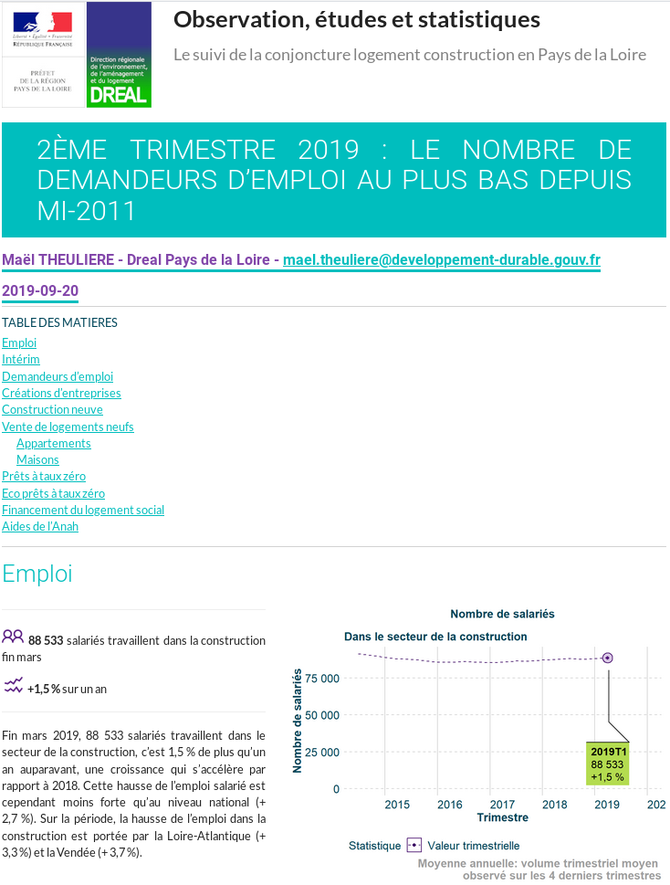
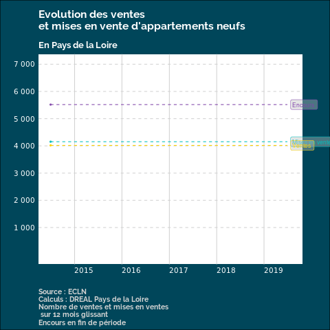
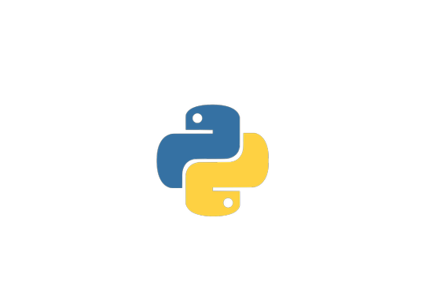
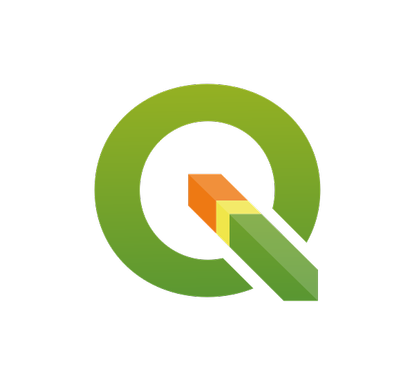

background-image: url(www/cover.jpg)

```{r setup, include=FALSE}
options(htmltools.dir.version = FALSE)
```

```{r xaringan-themer, include = FALSE}
library(xaringanthemer)
mono_accent(base_color = "#4874b8")
```


class: title-slide,center,middle
# Le logiciel R 
# Une (rapide) présentation
### Journée de la donnée 2019 - Commissariat général au développement durable
<hr />
### Murielle LETHROSNE - Maël THEULIERE - Marouane ZELLOU<br>
### 18 novembre 2019

---

# R c'est quoi ?

- Un langage de programmation interprété exécutable pas à pas → lignes de code

- Créé au milieu des années 90 mélange de S et du langage Lisp pour le dédier à l’analyse de données 
et à la création de graphiques

- Un projet né en 1993, une version 1.0.0 publiée le 29 février 2000

- Un logiciel libre (GNU GPLv2)

- Utilisé en recherche, en enseignement, dans le journalisme, l'administration et en entreprise

- Que l'on peut utiliser via un IDE de référence : [Rstudio](http://www.rstudio.com)

- Modulaire : système de packages installables permettant d'enrichir R de fonctionnalités. 
Le [CRAN](https://cran.r-project.org/) rassemble les packages ayant été soumis à un processus de validation mais on peut trouver aussi beaucoup de packages hors du CRAN sur des forges (github, gitlab...).

---

# Un logiciel en pleine explosion

.pull-left[
- Développement du logiciel libre

- Développement des sciences de la données
]

.pull-right[
Top 10 des langages de programmation (classement IEEE)

]

---

# R et le MTES-MCT 

- R répond à des besoins croissant de traitements et d'analyse de données

- R s'inscrit dans la promotion du logiciel libre du ministère (Qgis, PosgreSQL, Libre Office...)

- R est l'avenir dans la statistique publique : adopté comme standard par l’Insee (à l’horizon 2025) et divers Services Statistiques Ministériels (dont le SDES).

- R remplace progressivement SAS au sein de la statistique publique

---
class: inverse
# Que peut on faire avec R ?

---

# Lire toutes sortes de données...



---

# ... et gérer l'intégralité de la chaine de vie de la donnée

.pull-left[
- Mettre en forme
- Analyser
- Modéliser
- Présenter / publier des résultats
  - Datavisualisation / Tableaux / Cartes
  - Publications / Rapports
  - Livres
  - Présentations
  - Applications web
 ] 
.pull-right[

]

---
class: inverse

# Idées reçues

---

# Idées reçues

.left-column[
### Complexe

]

.right-column[
- Développement rapide hors sphère académique
- Formation de « littéraires »
]

---

# Idées reçues


.left-column[
### Complexe
### Peu performant
]

.right-column[
- Ok jusqu’à  10 000 000 lignes et quelques dizaines de colonnes 
- Version serveur (disponible au SDES), parallélisation
- Requêtage simple de bases de données
]

---

# Idées reçues


.left-column[
### Complexe
### Peu performant
### Hétérogène
]

.right-column[
- Tidyverse : une syntaxe unifiée pour l'essentiel des travaux data
]

---

# Idées reçues

.left-column[
### Complexe
### Peu performant
### Hétérogène
### Pas de certifications
]

.right-column[
- Journal of statistical software
- CRAN
]

---

# Idées reçues

.left-column[
### Complexe
### Peu performant
### Hétérogène
### Pas de certifications
### Pas stable
]

.right-column[
- 2 versions par an
]

---
class: inverse

# Les avantages

---
# Les avantages

.left-column[
### Gratuit
]

.right-column[
- Installable sur tout les postes du ministère (contrairement à SAS)
]

---

# Les avantages

.left-column[
### Gratuit
### Libre
]

.right-column[
- Partage du code, mutualisation
]

---

# Les avantages

.left-column[
### Gratuit
### Libre
### Adapté
]

.right-column[
- Un outil pour vraiment faire du traitement de données complexe
- Permet simplement de faire des choses qui seraient très complexes en bureautique
]

---

# Les avantages

.left-column[
### Gratuit
### Libre
### Adapté
### Intégré
]

.right-column[
- Un seul outil pour faire des cartes, graphiques et le rapport. 
- Pas besoin de passerelles
]

---

# Les avantages

.left-column[
### Gratuit
### Libre
### Adapté
### Intégré
### En ligne de code
]

.right-column[
- Traçabilité
- Reproductibilité
- Capitalisable (programmation fonctionnelle)

#### A utiliser avec git et gitlab/github pour tirer parti de toute cette richesse


]

---

# Les avantages

.left-column[
### Gratuit
### Libre
### Adapté
### Intégré
### En ligne de code
### Populaire
]

.right-column[
- Développements rapides
- Une documentation riche
- Une communauté utilisateurs sur laquelle s'appuyer
]

---

# Les limites

- Programmation en lignes de code

- Foisonnement de packages complémentaires

  - Choix
  
  - Maintenance de certains packages
  
  - Gestion des dépendances entre packages

---
class: inverse

# Quelques exemples d'utilisations

---
# SICLOP

- Application web de valorisation de données scrappées sur ouest france immo et nettoyée.

Packages utilisés : Tidyverse, Shiny, ggplot2, highcharter, leaflet

<a href="http://apps.datalab.pays-de-la-loire.developpement-durable.gouv.fr/siclop/"></a>


---
# Rapport de conjoncture logement construction
.pull-left[
- Rapport reproductible de valorisation des données de conjoncture.

Packages utilisés : Tidyverse, Rmarkdown, ggplot2,drealthemes,drealdown

[Lien](http://www.donnees.pays-de-la-loire.developpement-durable.gouv.fr/publications/conjoncture_logement_construction/conjoncture_logement_construction_2019T2.html)
]
.pull-right[
<a href="http://www.donnees.pays-de-la-loire.developpement-durable.gouv.fr/publications/conjoncture_logement_construction/conjoncture_logement_construction_2019T2.html"></a>
]
---
# gganimate

Permet la réalisation des graphiques animés


---
# gganimate

Permet la réalisation des graphiques animés



---
# Cartoviz

Exemple d'usage de R pour cartographier l'age moyen au sein des villes suisses.


---
class: inverse

# R par rapport à d'autres outils

---

# R versus Python

.pull-left[

- Dédié au traitement des données

- Programmation fonctionnelle

- Meilleur sur la dataviz
]

.pull-right[


- Généraliste

- Language objet

- Pas les mêmes problèmes de dépendances
]

---

# R versus Qgis

.pull-left[


- Ligne de code

- Permet de traiter tout type de données

- Outil intégré

]

.pull-right[


- Interface fenêtrée

- Dédié aux données géomatiques

- Dédié à la cartographie

]


---

# R versus PosgreSQL

.pull-left[


- Language in memory

- Gestion de l'ensemble du cycle de vie de la donnée

- Toutes les fonctionnalités géomatiques ne sont pas (encore) implémentées
]

.pull-right[


- Traitement des données sur disque

- Dédié au traitement de la donnée

- Permet tout type de traitement géomatique avec Postgis

]
---
class: inverse

# Se mettre à R au MTES-MCT

---
#### Se mettre à R au MTES-MCT

# L'offre de formation du CVRH

### Modules déployés
 
 - Premiers programmes en R
 - Préparation des données
 - Statistiques descriptives
 - Analyses des données multidimensionnelles
 - Datavisualisation : produire des graphiques, des cartes et des tableaux
 
---
#### Se mettre à R au MTES-MCT

# L'offre de formation du CVRH

### Modules en cours de finalisation
 - Publications reproductibles avec RMarkdown
 - Analyse spatiale

### Modules à venir
 - Applications interactives avec Shiny
 - Big data et optimisation du code
 - Le travail collaboratif avec R

Mis au fil de l'eau en open source sur [github](https://github.com/MTES-MCT/parcours-r), avec un [site web](https://mtes-mct.github.io/parcours-r/) d'accès aux versions des modules les plus à jour

---
#### Se mettre à R au MTES-MCT

# Des outils

### [Un kit d'installation prêt à l'emploi](https://github.com/MTES-MCT/parcours-r/blob/master/documents/preparation_pack_install_libraries.R)

### Un serveur Shiny pour le MTES - MCT

### Une [faq](http://pne.metier.e2.rie.gouv.fr/la-faq-de-r-r1028.html) pour le partage de connaissance

---
#### Se mettre à R au MTES-MCT

# Des lieux d'échange

### Un [salon des utilisateurs R](https://ariane.din.developpement-durable.gouv.fr/channel/utilisateurs_r ) sur Ariane

### Une liste d'échange entre utilisateurs

Pour s'insrire, envoyer un message vide avec le titre "subscribe  labo.communaute-r" à l'adresse sympa@developpement-durable.gouv.fr ou cliquer directement sur [ce lien](mailto:sympa@developpement-durable.gouv.fr?subject=subscribe  labo.communaute-r)


---
#### Se mettre à R au MTES-MCT

# Des événements de communication autour de R

- Cette journée !

- Des ateliers utilisateurs à Orléans

- Des funcamp en 2020 avec l'Insee autour de R
---

#### Se mettre à R au MTES-MCT

# Quelle complémentarité avec les autres outils du ministère ?

- Qgis et R ne s'adressent pas au même public

- Géokit 3 et Géoidd sont des outils à l'avenir incertain, mais plus à cause du datalake que de R

- R est très complémentaire du datalake : se connecter aux données par API pour produire des valorisations reproductibles.

- Il est fortement conseillé d'utiliser git et gitlab/github avec R afin de tracer son travail au mieux et de travailler à plusieurs : vers une approche [DataOps](https://www.dataopsmanifesto.org/) de nos travaux "data".


---
class: inverse

## Une vision du futur

---

## Une vision du futur

### Aujourd'hui

.pull-left[
- des chargés d'études perdant beaucoup de temps dans le traitement des données et l'utilisation d'outils multiples pour valoriser leurs données
]

.pull-right[

]

---
## Une vision du futur

### Demain

.pull-left[
- Des outils de traitements de la données intégrant l'ensemble du cycle de vie de la données et mis en oeuvre par des spécialistes du domaine :  de l'intégration à la valorisation

- Des chargés d'études recentrés sur l'analyse et le portage des politiques publiques
]

.pull-right[

]


